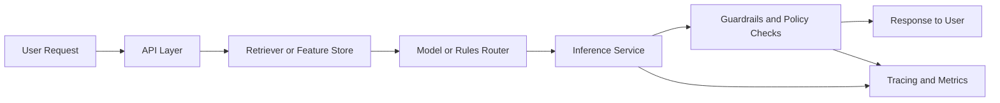

# System Design for AI Interviews

> AI system-design interviews are usually testing whether you can reason about trade-offs, failure modes, and operating constraints, not whether you can recite brand names.

---

## TL;DR

- **What**: A framework for answering AI and GenAI system-design interview questions clearly.
- **Why**: These interviews often feel broad and ambiguous unless you structure the problem aggressively.
- **Key point**: Clarify the task, define success metrics, choose the right interaction pattern, then walk through reliability, cost, safety, and evaluation.

---

## Overview

### Definition

This note is a practical interview-prep guide for designing AI assistants, RAG systems, agent workflows, recommendation services, and ML platforms in interviews.

### Scope

It focuses on answer structure and trade-off language rather than implementation detail.

### Significance

- AI system-design interviews appear across AI engineer, ML engineer, MLOps, and platform roles.
- Clear structure often matters more than maximum breadth.
- This note turns many repo concepts into a reusable interview pattern.

### Prerequisites

- [AI System Design for GenAI Applications](../production/ai-system-design.md)
- [Model Serving for LLM Applications](../production/model-serving.md)
- [Monitoring & Observability for GenAI Systems](../production/monitoring-observability.md)

---

## Deep Dive

### A Reliable Answer Structure

1. Clarify the user, task, and scale.
2. Define success metrics and unacceptable failures.
3. Pick the system pattern: prompt-only, RAG, agent, classical ML, or hybrid.
4. Walk the request path.
5. Add storage, serving, and scaling choices.
6. Cover safety, observability, and evaluation.
7. Close with bottlenecks, trade-offs, and future improvements.

### Questions To Clarify Early

| Question | Why It Matters |
|---|---|
| Who are the users? | changes UX and safety bar |
| What accuracy is required? | determines whether human review is needed |
| Is latency interactive? | shapes serving and model choice |
| What data is private or dynamic? | drives RAG, governance, and storage |
| What is the budget? | affects routing and infra choices |

### Common AI Design Scenarios

| Scenario | Likely Pattern |
|---|---|
| internal knowledge assistant | RAG + citations + observability |
| coding copilot | retrieval + tool use + policy checks |
| support automation | conversational system + workflow tools + escalation |
| large-scale inference platform | serving, autoscaling, caching, cost control |
| fraud or ranking service | classical ML or hybrid stack |

### Trade-Off Buckets To Always Mention

- quality
- latency
- safety
- cost
- maintainability
- evaluation maturity

### Good Closing Language

End answers with:

- main bottleneck
- rollout path
- what you would measure after launch
- one or two likely future improvements

### Example: Baseline Interview Flow

### Common Mistakes

- jumping into tools without clarifying requirements
- using agents when a simpler design is enough
- ignoring evaluation and monitoring
- never mentioning fallback or escalation
- treating scale as only QPS, not data freshness or workflow complexity

---

## Quick Reference

| If Asked To Design... | Mention Early |
|---|---|
| RAG assistant | data freshness, retrieval quality, groundedness |
| agent workflow | tool permissions, observability, task success |
| model-serving platform | latency, throughput, autoscaling, GPU economics |
| enterprise AI feature | auth, tenancy, compliance, fallback behavior |

---

## Gotchas

- Fancy architecture without requirement clarity usually scores worse.
- Interviewers care about trade-off reasoning more than product-brand trivia.
- A clean baseline architecture is often better than an overbuilt "future-proof" one.

---

## Interview Angles

- **Q**: What is the most common mistake in AI system-design interviews?
- **A**: Skipping clarification and jumping straight into tools. Good answers start with requirements, success metrics, and failure tolerance before architecture.

- **Q**: What should you always mention in a GenAI system design?
- **A**: Evaluation, observability, safety boundaries, and cost. Those are the recurring points that separate prototypes from real systems.

---

## Connections

| Relationship | Topics |
|---|---|
| Builds on | [AI System Design for GenAI Applications](../production/ai-system-design.md), [Model Serving for LLM Applications](../production/model-serving.md), [Monitoring & Observability for GenAI Systems](../production/monitoring-observability.md) |
| Leads to | role-specific interview prep, architecture reviews |
| Compare with | generic distributed-systems interviews |
| Cross-domain | communication, product reasoning, platform thinking |

---

## ◆ Production Failure Modes

| Failure | Symptoms | Root Cause | Mitigation |
|---------|----------|------------|------------|
| **Over-engineering in design** | 30-minute answer covers infrastructure but misses requirements | Jumped to tools before clarifying the problem | Always start with 5 min of requirements, metrics, constraints |
| **Missing evaluation story** | Interviewer asks "how do you know it works?" and candidate freezes | Forgot to plan evaluation as part of the design | Include eval from the start: offline metrics, online A/B, human review |
| **No cost analysis** | "Just use GPT-4 for everything" | Didn't calculate cost at scale | Always estimate: requests/day × cost/request = monthly cost |
| **Ignoring failure modes** | Design only covers happy path | No mention of latency spikes, model failures, or safety | Explicitly discuss: what breaks? how do you detect it? how do you recover? |

---

## ◆ Hands-On Exercises

### Exercise 1: Practice System Design

**Goal**: Design an AI system in 35 minutes (interview simulation)
**Time**: 35 minutes
**Steps**:
1. Pick a prompt: "Design an AI-powered customer support system for an e-commerce company"
2. Spend 5 min on requirements (scope, scale, latency, safety)
3. Spend 15 min on architecture (retrieval, model, routing, tools)
4. Spend 10 min on evaluation, monitoring, and cost
5. Spend 5 min on scaling and failure modes
**Expected Output**: Architecture diagram, component decisions with rationale, metrics plan

---

## ★ Recommended Resources

| Type | Resource | Why |
|------|----------|-----|
| 📘 Book | "AI Engineering" by Chip Huyen (2025) | Covers AI system design end-to-end — the single best prep resource |
| 📘 Book | "Designing Machine Learning Systems" by Chip Huyen (2022) | System design fundamentals — data, features, serving, monitoring |
| 🎥 Video | [Alex Xu — "System Design Interview" Series](https://www.youtube.com/@ByteByteGo) | Best visual explanations of system design interview techniques |
| 🔧 Hands-on | [AI System Design Practice Problems](https://www.educative.io/) | Structured practice with AI-specific system design prompts |
| 📄 Paper | [Google "MLOps: Continuous delivery for ML"](https://cloud.google.com/architecture/mlops-continuous-delivery-and-automation-pipelines-in-machine-learning) | Production ML patterns frequently tested in interviews |

---

## ★ Sources

- [AI System Design for GenAI Applications](../production/ai-system-design.md)
- [Monitoring & Observability for GenAI Systems](../production/monitoring-observability.md)
- [Distributed Systems Fundamentals for AI](../tools-and-infra/distributed-systems-for-ai.md)
- Huyen, C. "AI Engineering" (2025)
- Huyen, C. "Designing Machine Learning Systems" (2022)
